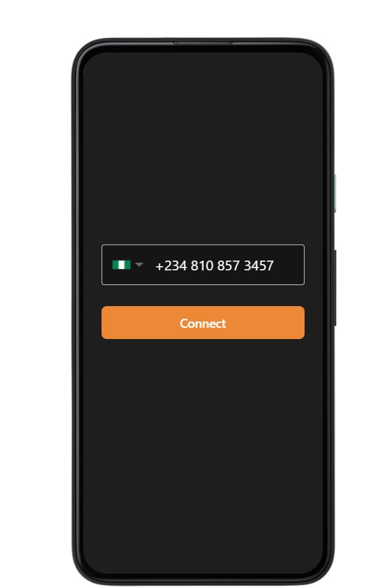
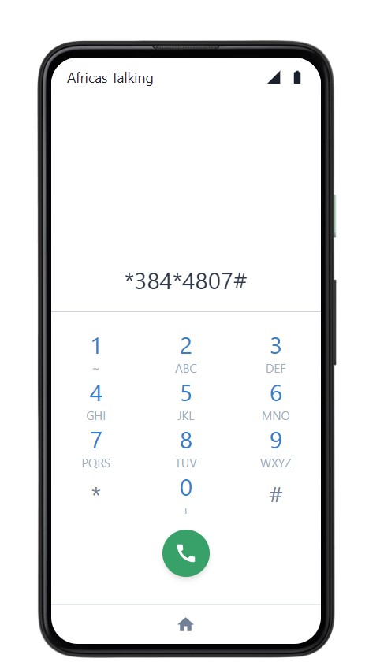

## Welcome to "384"4807# Taimako USSD Code

Please use the [simulator](https://developers.africastalking.com/simulator) to dial the USSD code.Input your number, click on the phone icon then dial the code.

The current path is created for English only. The idea is still in progress. We will add the other option later on. 
You can navigate with 1->1->1->1->1,2or3.

See the navigation below.


### Markdown
This is still in the ideation stage. 
We are open for suggestions on how we can improve on the idea. 
```markdown






### Support or Contact

Having trouble with Pages? Check out our [documentation](https://docs.github.com/categories/github-pages-basics/) or [contact support](https://support.github.com/contact) and we’ll help you sort it out.
